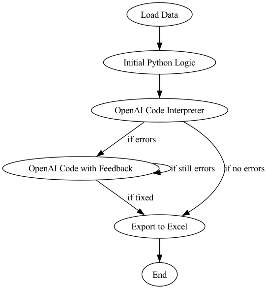
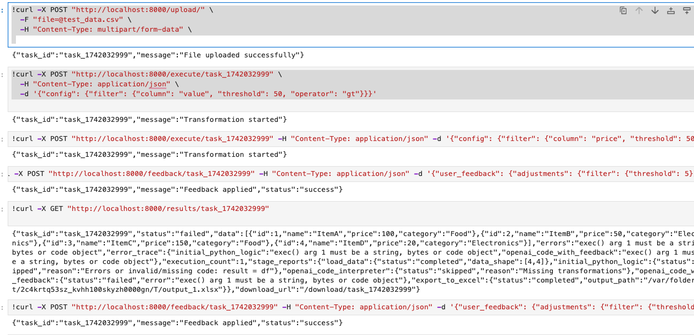

## Feedback Agent Code Reviewer

This project implements a feedback agent that reviews and improves Python code, particularly focusing on data transformation tasks involving Pandas DataFrames. It leverages LangChain and LangGraph to create a ReAct agent powered by OpenAI's GPT-4 model, enabling it to debug code, execute it in a safe environment, and process user feedback.

### Flow

   <p align="center">
       
   </p> 

## Features

* **Code Debugging and Improvement:** Uses GPT-4 to analyze and enhance Python code, ensuring it defines a `transform_data` function for DataFrame manipulation.
* **Safe Code Execution:** Executes user-provided code in a restricted environment to prevent security vulnerabilities.
* **File Upload and Analysis:** Allows users to upload CSV or Excel files and process them using their custom code.
* **Feedback Processing:** Enables users to provide feedback on the code analysis and execution results, which the agent then uses to refine its output.
* **Asynchronous Processing:** Utilizes FastAPI and asynchronous operations for efficient handling of requests.
* **Dockerized Application:** Provides a Dockerfile for easy deployment and containerization.

## Architecture

* **FastAPI:** Serves as the web framework for handling API requests and responses.
* **LangChain:** Provides the interface for interacting with the OpenAI GPT-4 model and defining tools.
* **LangGraph:** Implements a ReAct agent for complex workflow management and stateful interactions.
* **Pandas:** Used for data manipulation and processing.
* **Uvicorn:** An ASGI server for running the FastAPI application.
* **Docker:** Containerizes the application for easy deployment.

## code structure

                    Feedback_Agent_code_reviewer/
                    ├── data/
                    │   ├── outputs/
                    │   └── uploads/
                    ├── src/
                    │   ├── model/
                    │   │   └── model.py
                    │   ├── tools/
                    │   │   └── tools.py
                    │   ├── validate/
                    │   │   └── validate.py
                    │   └── requirements.txt
                    ├── fastapi_app.py
                    ├── Dockerfile
                    └── README.md
                    
### Prerequisites

* Python 3.11+
* Docker (for containerized deployment)
* OpenAI API key which needs to be export as ENV 

### Installation

1.  **Clone the repository:**

    ```bash
    git clone https://github.com/ALLUPRASAD/Feedback_Agent_code_reviewer.git
    cd Feedback_Agent_code_reviewer
    ```

2.  **Create a virtual environment (recommended):**

    ```bash
    python3 -m venv venv
    source venv/bin/activate  
    ```

3.  **Install dependencies:**

    ```bash
    pip install -r requirements.txt
    ```

4.  **Set up environment variables:**

    * Create a `.env` file or set the `OPENAI_API_KEY` environment variable.

5.  **Run the application (local):**

    ```bash
    uvicorn fastapi_app:app --host 0.0.0.0 --port 8000 --reload
    ```

### Docker Deployment

1.  **Build the Docker image:**

    ```bash
    docker build -t feedback-agent .
    ```

2.  **Run the Docker container:**

    ```bash
    docker run -p 8000:8000 -e OPENAI_API_KEY="YOUR_OPENAI_API_KEY" feedback-agent
    ```

    * Replace `YOUR_OPENAI_API_KEY` with your actual OpenAI API key.

### API Endpoints

* **`/upload/` (POST):** Upload a CSV or Excel file.
* **`/analyze/` (POST):** Analyze Python code and process the uploaded file.
* **`/feedback/` (POST):** Provide feedback on the analysis results.
* **`/errors/{request_id}` (GET):** Retrieve error logs.

### Example Usage

run app_new.py

   <p align="center">
       
   </p> 


    
